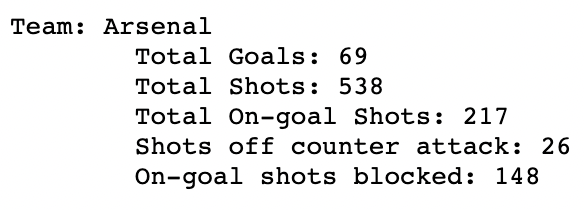

# 721 Final Project 
### By Alison Reynolds & Jackie Du 

 

## Overview 
Our final project is an European club soccer shot analysis in the form of a web microservice. The microservice contains endpoints that analyzes teams' shot efficiency both by aggregate statistics for a specific team as well as through the results of an expected goals model. 

## Endpoints 
1. `/`: Welcome page

2. `/team_results`: Displays the results of the expected goals model on a team level 
    
The x-axis shows the model prediction for each team and the y-axis is the true value.
   

3. `/player_results`: Displays the results of the expected goals model on a player level 
    
The x-axis shows the model prediction for each player and the y-axis is the true value.
   

4. `/team/{team_name}`: Display summary shot statistics for a specified team name
    
For each team, this page shows the number of total goals for the team, how many shots they attempted, how many of those shots were on goal, how many of those shots came during a counter attack, and how many shots were blocked.
   

## Setup 

### Configure AWS Authentication 
1. Create an IAM User policy with `AmazonS3FullAccess` permissions. 
2. Then, create access key for that user policy 
3. Store access key id and secret as `AWS_ACCESS_KEY_ID` and `AWS_SECRET_ACCESS_KEY`, respectively, as GitHub codespace secrets (or alternatively in your local ~/.aws/credentials file). 

### Configure S3 
1. Create S3 bucket named `721-final-project`
2. Create access point for bucket 
3. Store access point alias as `AWS_S3_BUCKET` as a GitHub codespace secret (or alternatively in your local ~/.aws/credentials file)

## Architecture 

## Data 
The data used in this project is taken from an [opensource project](https://www.nature.com/articles/s41597-019-0247-7) that created soccer logs to record every spatio-temporal match event that took place during the 2017-2018 club soccer seasons in England, France, Germany, Spain, and Italy. For every league game that occurred, each individual match event (e.g., shots, fouls, passes, duels) was recorded, along with the time and location on the pitch for which it took place.

The data was filtered to focus only on shots and its different attributes, as we were interested in how and to what extent club teams differ in their shooting efficiency, as after all winning a soccer match comes from shooting more goals. 

## Model 
### Expected Goals Model Description 
Expected goals is a statistical measure that tries to give a more fair assessment than raw scored goals. Since soccer is a low-scoring sport, the final result is often not a good summary of how the game developed.

An expected goals model assigns a probability score to each shot. This score approximates the probability of the given shot resulting in a goal. With these probability scores, analysts can draw stronger conclusions on team or individual performance.

### Model Data Processing
Based on the shot coordinates, we create two additional features. First, we calculate the distance from the shot origin to the center of the goal. We also calculate the angle between the shot origin and the inner box. Intuitively, a small angle means that the player did not have a clear view of the goal. We do the angle calculation with the inner box because we do not know the positions of the posts in the pitch and the angle defined with the inner box is similar to the angle defined with the goal (in a statistical sense, at least).

Since we expect non-linear interactions between the variables, we use a random forest to model the probabilities. We set it up as a binary classification task where the response is whether or not the shot was a goal. To evaluate the model we use the area under the ROC curve because we are more interested in the probability scores than in the actual classification labels.

We split the data into a training and a test set based on a stratified sample. We stratify because no-goals are much more prevalent in the data. To set the hyperparameters we use stratified k-fold cross validation and a grid search

## Benchmarking 

     

     

